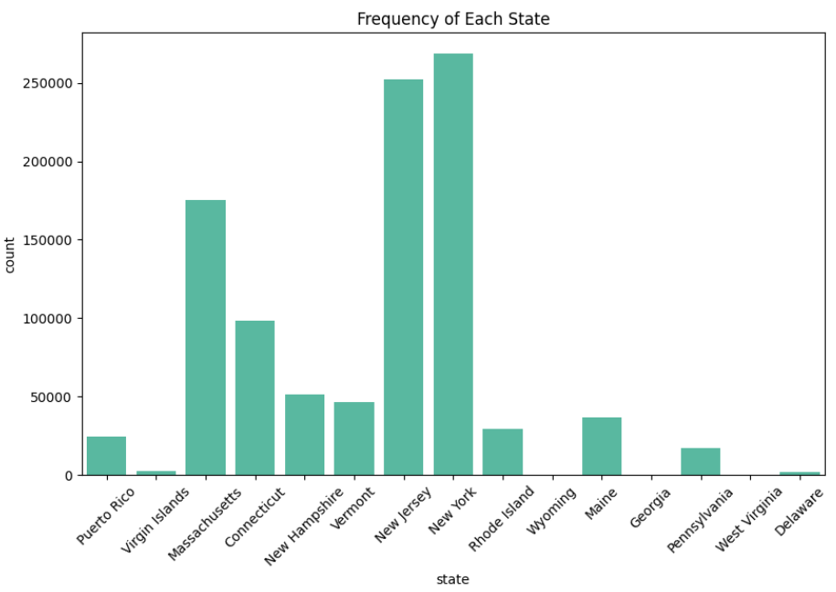
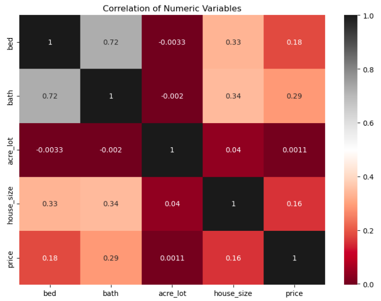
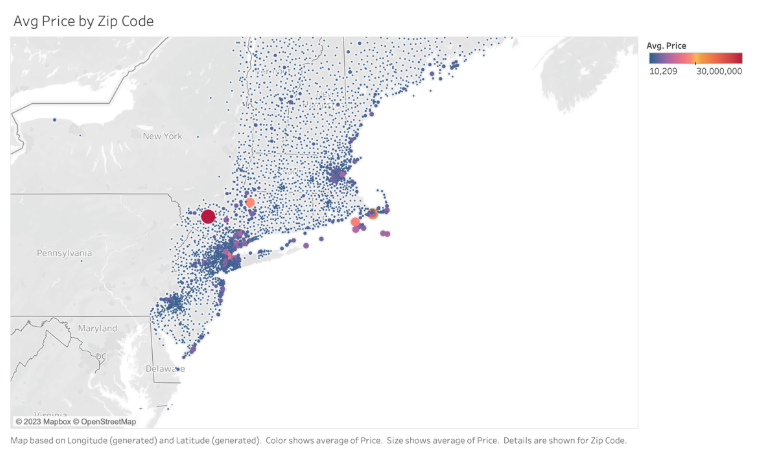
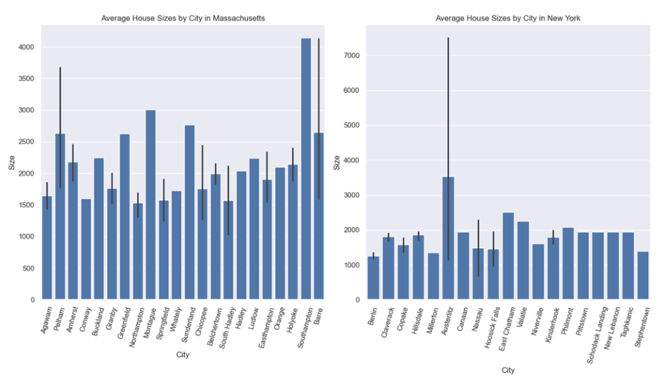
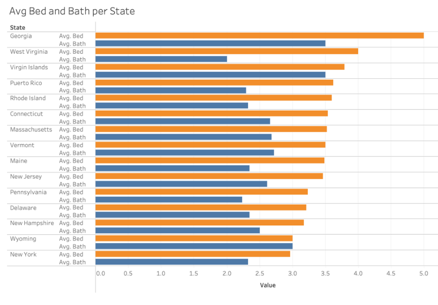

# 📌 Project Background 

Real estate is the largest asset class in the world. It holds significant business implications for investors, real estate professionals, and potential homeowners. Forecasting housing trends can help promote more well-informed decisions when buying, selling, or investing in properties. For individuals and businesses, these insights can become a useful tool to gain a competitive edge when navigating through the world of real estate. Understanding the relationship between the physical attributes of a property and its market value is important for both real estate professionals and prospective buyers.  

This project uses the USA Real Estate [dataset](https://www.kaggle.com/datasets/ahmedshahriarsakib/usa-real-estate-dataset/data) from Kaggle.  

<i>In collaboration with Yilu Chen, Andrew Gatchalian, Hsuan-Yi Lin, and Rakesh Venkata Subramaniyan.</i>  

# 📊 Exploratory Data Analysis  
- The presence of outliers is evident, particularly in features like bed, bath, acre_lot, and house_size.
- The average property listing was priced at $886,657 with a standard deviation of over $2M indicating a large distribution range.
- There are missing values in the dataset that inaccurately represent some listings.
- The data represents a wide range of states that cover the Eastern, Mid-Atlantic, and Caribbean territories. As shown in the bar chart below, New York and New Jersey are the states that account for over 500,000 listings combined, followed by Massachusetts with approximately 175,000 listings.  
    
      
      
- The variables bed, bath, and house_size are positively correlated to price, meaning that the property price tends to increase as these features increase, as shown in the heat map below. (The redder the square, the weaker the correlation. The darker the gray or black, the stronger the correlation.)  
    
      
      
- In this dataset, New York appears to be the state with the highest average property price at over $1.4 million, whereas West Virginia appears to be the state with the lowest average property price, averaging around $62,000 per property. Additionally, the property price seems to increase in high-density urban areas such as New York City and parts of Boston, as shown in the map below.  
    
      
      
- Though New York and Massachusetts share similarities with their high average listing price, the features of these properties differ significantly. On a city-by-city comparison, the average house size in Massachusetts is much larger than that of New York. The smaller property size combined with the high price makes New York the state with the highest average price per square foot in this dataset.  
    
      
    
- Georgia, West Virginia, and the Virgin Islands seem to have the highest average number of bedrooms and bathrooms per property.
    
      
    

Highlighting these relationships helped us gain a deeper understanding of the data which offered valuable insight as we continued our analysis through machine learning models.  

 

